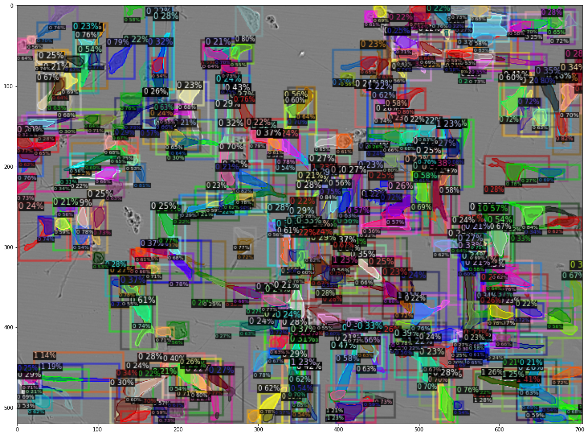
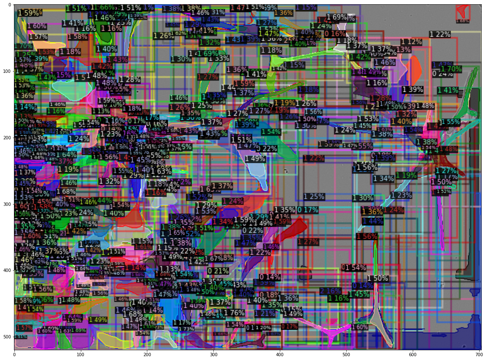

# Cell Instance Segmentation
This repo is dedicated for the Kaggle challenge - 
[sartorious cell instance segmentation](https://www.kaggle.com/c/sartorius-cell-instance-segmentation/overview/description).
It majorly leverages [MMDetection](https://github.com/open-mmlab/mmdetection) for training the instance segmentation model.

## Installation
Clone the repo
```bash
git clone https://gitlab.com/telekinesis/synthetic_data_generation.git
```

Create a new Conda environment called `cell_is`:
```
conda create -n cell_is python=3.8
```

To activate the environment:
```
conda activate cell_is
```

To deactivate the environment:
```
conda deactivate
```

### Requirements
The following dependencies are required to run the package (recommend to use `pip install`):
- [Python3 (==3.8)](https://www.python.org/downloads/)
- [Miniconda](https://docs.conda.io/en/latest/miniconda.html#installing)
- [MMDetection](https://mmdetection.readthedocs.io/en/latest/get_started.html)
- [jupyterlab](https://pypi.org/project/jupyterlab/)
- [pillow](https://pypi.org/project/pillow/)
- [numpy](https://pypi.org/project/numpy/)
- [pandas](https://pypi.org/project/pandas/)
- [opencv-python](https://pypi.org/project/opencv-python/)
- [matplotlib](https://pypi.org/project/matplotlib/)
- [seaborn](https://pypi.org/project/seaborn/)
- [PyYAML](https://pypi.org/project/PyYAML/)
- [scipy](https://pypi.org/project/scipy/)
- [scikit-learn](https://pypi.org/project/scikit-learn/)
- [pytorch](https://pytorch.org/) [**Note: Use CUDA 11.8**]

## Project Structure

A clear project structure helps us in collaboration and automation of tasks like automated tests.

### Folders

* `analytics`: contains all the Jupyter notebooks.
* `code`: contains python top-level package of the source code including the code of the experiments.
  * `data`: contains code for preprocessing.
  * `experiments`: contains the experiment code.
  * `model`: contains the code for modeling.
  * `utils`: contains the helper code.
* `dataset`: contains both LIVECell dataset and the dataset for competition (currently not synchronized with remote repo 
  for its size).
* `docs`: contains the references and summaries.
* `Install`: contains instruction of configuring the virtual environment based on pip3.
* `results`: contains the results of the experiments.

## Usage
As the data pipeline for cell instance segmentation is used for Kaggle competition, it is finally presented in a jupyter notebook.
To run it, please do
```
cd examples
# Run cell_instance_segmentation.ipynb
```

## Roadmap
- Variant 1 - modeling and training: transfer learning of state-of-the-art model trained on COCO, from on LIVECell to the 
  current dataset for the competition
  
- Variant 2 - modeling and training: transfer learning of the LIVECell-based models with adaptations on the current dataset 
  for the competition 


## Demos
### Sanity check on the two public test images




### Result
FINAL RANK: [981/1506](https://www.kaggle.com/competitions/sartorius-cell-instance-segmentation/leaderboard) based on the 
undisclosed test data of Sartorius.


### Experiments Structure

Every experiment has a unique **name**.
This name is defined by the experiment and should be used to create corresponding sub folders in the global `results`.
They need to follow this structure `<NAME>/YYYY-MM-DD_hh:mm:ss/` to store results and/or figures.
  
  