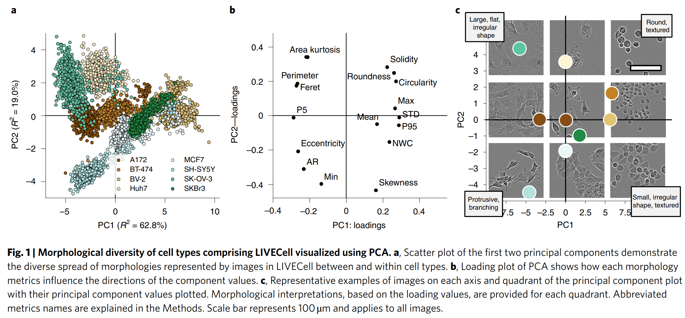

rkx_cell_is
===========

This serves as a private repo for the [sartorious cell instance segmentation competition](https://www.kaggle.com/c/sartorius-cell-instance-segmentation/overview/description).

## References
### LIVECell instance segmentation
The link to the [paper](References/LIVECell%20-%20A%20large-scale%20dataset%20for%20label-free%20live%20cell%20segmentation.pdf).

The link to the [code](https://github.com/sartorius-research/LIVECell).

### Basic paper for instance segmentation
**Object detection**: R-CNN, Fast R-CNN, Faster R-CNN.

**Semantic segmentation**: FCN for semantic segmentation.

**Instance segmentation**: Mask R-CNN, [U-Net](References/U-Net%20Convolutional%20Networks%20for%20Biomedical%20Image%20Segmentation.pdf)

### New Breakthroughs related with instance segmentation
The following papers are new breakthroughs in DLCV, which are based on the new backbone and now rank
at the top of [COCO competition](https://paperswithcode.com/sota/instance-segmentation-on-coco).

+ [Paper 1](References/End-to-End%20Semi-Supervised%20Object%20Detection%20with%20Soft%20Teacher.pdf)
+ [Paper 2](References/CBNetV2%20-%20A%20Composite%20Backbone%20Network%20Architecture%20for%20Object%20Detection.pdf)
+ [Paper 3](References/Focal%20Self-attention%20for%20Local-Global%20Interactions%20in%20Vision%20Transformers.pdf)
+ [Paper 4](References/Swin%20Transformer%20-%20Hierarchical%20Vision%20Transformer%20using%20Shifted%20Windows.pdf)

## Investigation on data
### Cell Morphology

- **BV-2**: small and round
- **SK-OV-3**: large and flat
- **SH-SY5Y**: neuronal-like
  
## Others
- [ ] Read through the LIVECell paper and code

### Differences between YOLO and R-CNN
- Performance over small and dense objects