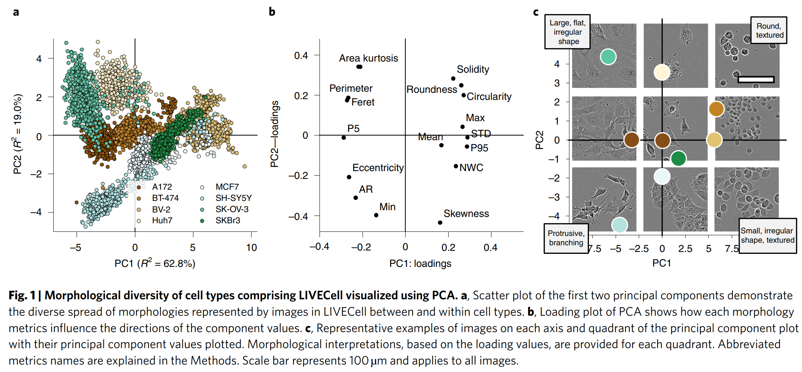

## References
### LIVECell instance segmentation
The link to the [paper](LIVECell%20-%20A%20large-scale%20dataset%20for%20label-free%20live%20cell%20segmentation.pdf).

The link to the [code](https://github.com/sartorius-research/LIVECell).

### Basic paper for instance segmentation
**Object detection**: R-CNN, Fast R-CNN, Faster R-CNN.

**Semantic segmentation**: FCN for semantic segmentation.

**Instance segmentation**: Mask R-CNN, [U-Net](U-Net%20Convolutional%20Networks%20for%20Biomedical%20Image%20Segmentation.pdf)

### New Breakthroughs related with instance segmentation
The following papers are new breakthroughs in DLCV, which are based on the new backbone and now rank
at the top of [COCO competition](https://paperswithcode.com/sota/instance-segmentation-on-coco).

> **[Paper 1](End-to-End%20Semi-Supervised%20Object%20Detection%20with%20Soft%20Teacher.pdf)**: ranks the 1st 
  (multi-scale) and the 2nd (single-scale)

> **[Paper 2](CBNetV2%20-%20A%20Composite%20Backbone%20Network%20Architecture%20for%20Object%20Detection.pdf)**
  : ranks the 3rd (multi-scale) and the 4th (single-scale)

> [Paper 3](Focal%20Self-attention%20for%20Local-Global%20Interactions%20in%20Vision%20Transformers.pdf):

> [Paper 4](Swin%20Transformer%20-%20Hierarchical%20Vision%20Transformer%20using%20Shifted%20Windows.pdf):

### COCO dataset

- Download links to COCO dataset and its surroudings: https://cocodataset.org/#download
- Meaning of *iscrowd's values*: 0 if your segmentation based on polygon (object instance, or say, the instance 
represents a single object); 1 if your segmentation based uncompressed RLE (crowd, or say, the instance represents a 
collection of objects). **RLE** is abbreviated for run length encoding representations. Hers is 
[Useful links](https://stackoverflow.com/questions/49494337/encode-numpy-array-using-uncompressed-rle-for-coco-dataset).
- 
## LIVECell: Data exploration
### Characters of LIVECell dataset
- It offers a robust dataset for pretraining before fine-tuning on small datasets due to its size, morphological diversity
  and high object density.
  
### Cell Morphology

- **BV-2**: small and round
- **SK-OV-3**: large and flat
- **SH-SY5Y**: neuronal-like

## Others

### Differences between YOLO and R-CNN
- Performance over small and dense objects

### Differences between anchor-based and anchor-free models
See [the link (zhihu)](https://zhuanlan.zhihu.com/p/62372897) and
[the link](https://towardsdatascience.com/single-stage-instance-segmentation-a-review-1eeb66e0cc49).

- Anchor-based and anchor-free models perform on par with each other in terms of overall AP metric and anchor-based model
  perform slightly better than the other one in terms of AFNR metric when executing detection and segmentation tasks.
  
- However, anchor-free model behaves better than the other one on highly confluent (or say, **overconfluent**) images 
  possibly due to their inherently different detection mechanisms.
    - *Anchor-based detection* means that the localization of objects is based on a set predefined anchor boxes, that is 
      rectangles of different sizes and aspect ratios. These anchor boxes are used to predict the existence of objects 
      at each spatial location in the CNNs intermediate representation of the original image. The most confident top few 
      anchor boxes over a certain threshold are selected to represent the bounding boxes of predicted objects. Then for 
      instance segmentation, the area within each bounding box is segmented to outline the contained object as well.
        - In this paper, an adapted version of [Cascade Mask RCNN](https://arxiv.org/abs/1906.09756) using a [ResNeSt-200 
          backbone paper](https://arxiv.org/abs/2004.08955) and [code](https://github.com/chongruo/detectron2-ResNeSt) is 
          applied.
      
    - *Anchor-free detection* means that the object detection does not depend on a predefined set of anchor boxes. 
      Instead, it uses [a fully convolutional one-stage (FCOS) object detection](https://arxiv.org/abs/1904.01355) to 
      predict the center points of objects and directly define bounding boxes, circumventing the need for additional 
      hyper-parameters. 
        - In this paper, the model is based on [CenterMask paper](https://arxiv.org/abs/1911.06667) and 
          [code](https://github.com/youngwanLEE/centermask2), which is an anchor-free one-stage architecture with a 
          [VoVNet2-FPN backbone using FCOS detection](https://arxiv.org/abs/1904.01355).

### Difficulties of current models trained on LIVECell dataset
- The CNN-based models **struggle to learn/model the long-range dependencies** even though they can effectively describe
  translation equivariance and locality. Specifically, it reflects itself in the low accuracy scores in the specific cell
  type **SH-SY5Y**, which is characterized by the highly asymmetric and concave-shaped morphology. Recent model 
  [architecture 1](https://arxiv.org/abs/2003.07853) and [architecture 2](https://arxiv.org/abs/2010.11929) aim to relieve
  these limitations.
- The average number of objects per image in LIVECell dataset is **313**, which is substantially higher than typical instance 
  segmentation dataset such as Microsoft COCO (7.8 objects per image) or dense dataset such as SKU-110K (147.4 objects per
  image). The paper around the LIVECell has therefore found in the both baseline models that they demonstrate linear increases in 
  processing time with object counts. To avoid slow performance speed and heavy memory requirements, an ideal model design
  should be proposed to minimize or bypass this linear trend. 